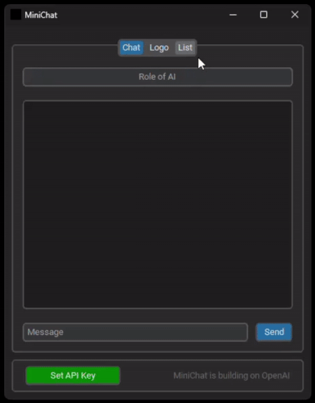

# MiniChat
<div align="center">


</div>

<div align="center">


</div>

<p align="center">
   <a href="#demo" title="Click to view full-size GIF in Demo section">
      
  </a>
</p>

## Table of Contents
1. [Description](#description)
2. [Demo](#demo)
3. [Prerequisites](#prerequisites)
4. [Usage of Executable](#usage-of-executable)
5. [Usage of Python Scripts](#usage-of-python-scripts)
6. [Usage of MiniChat](#usage-of-minichat)
7. [To-Do](#to-do)
8. [Authors](#authors)
9. [Acknowledgements](#acknowledgements)
10. [License](#license)

## Description
MiniChat is a [Python](https://www.python.org/) GUI application built with [CustomTkinter](https://customtkinter.tomschimansky.com/) and powered by the [OpenAI API](https://openai.com/). It offers three core features:

- **Chat**: Communicate with a user-defined entity.
- **Logo**: Create custom logos for your chat interactions.
- **List**: Manage a list of chat-logo items (add, delete, modify publicity settings, and view details).

🚧 This project is a work in progress. Some features may be incomplete, untested, or lacking full documentation. 🚧

## Demo
<p align="center">
  
</p>

## Prerequisites
- [Python 3.12.0](https://www.python.org/downloads/release/python-3120/)
- [OpenAI API Key](https://platform.openai.com/api-keys)

## Usage of Executable
### 1. Build an executable using shell script
```bash
$ . create_exe.sh <arg1>
```
   - `<arg1>`: Suffix for naming the virtual environment (optional).  
   Examples:
   ```bash
   $ . create_exe.sh              # Creates /exe/minichat/minichat.exe
   $ . create_exe.sh test         # creates /exe/minichat_test/minichat_test.exe
   ```
### 2. Run the executable
Run **MiniChat** by double-clicking the `minichat.exe` file located in the `/exe/minichat` directory.

## Usage of Python Scripts

### 1. Installing Python Packages
- **With a Virtual Environment (using a shell script)**:
```bash
$ . venv_setup.sh <arg1> <arg2>
```
   - `<arg1>`: Suffix for naming the virtual environment (optioanla).
   - `<arg2>`: Set to "dev" to include `requirements_dev.txt` (optioanla)  
   Examples:
   ```bash
   $ . venv_setup.sh               # Creates .venv_minichat
   $ . venv_setup.sh test          # Creates .venv_minichat_test
   $ . venv_setup.sh "" dev        # Creates .venv_minichat_dev
   $ . venv_setup.sh test dev      # Creates .venv_minichat_test_dev
   ```
- **Without a Virtual Environment**:
```bash
$ python -m pip install --upgrade pip
$ pip install -r requirements.txt
$ pip install -r requirements_dev.txt
```

### 2. Running MiniChat
```bash
$ python -m src.minichat
```

### 3. Running Pylint (with `requirements_dev.txt`)
```bash
$ pylint src/<name_of_file>
```

### 4. Running a Single Unit Test (with `requirements_dev.txt`)
```bash
$ python -m test.test_logger_00
$ python -m test.<name_of_test_file>
```

### 5. Running All Unit Tests (with `requirements_dev.txt`)
```bash
$ python -m unittest discover test
```

### 6. Running Coverage with Unit Tests (with `requirements_dev.txt`)
```bash
$ python -m coverage run -m unittest discover test
$ python -m coverage report
$ python -m coverage html
```
View the HTML coverage report at: `htmlcov/index.html`

## Usage of MiniChat
After launching the MiniChat GUI, the **Set API Key** button indicates the status of your OpenAI API key (red = invalid, green = valid). You can use this button to update your API key. When the button turns green, you can access the features of the application.

### Chat Tab:
- Define the entity you want to chat with.
- Send and receive messages.

### Logo Tab:
- Define the parameters for the logo you wish to generate.
- Generate the logo.

### List Tab:
- Add your previously created chats and logos to the list.
- Modify the visibility of listed items.
- Delete items from the list.
- View items.

### Keyboard Shortcuts
- <kbd>Alt</kbd> + <kbd>Left Arrow</kbd>: Navigate to the next tab to the left.
- <kbd>Alt</kbd> + <kbd>Right Arrow</kbd>: Navigate to the next tab to the right.
- <kbd>Enter</kbd>: Trigger the **Send** button on the **Chat** tab.
- <kbd>Enter</kbd>: Trigger the **Generate** button on the **Logo** tab.
- <kbd>Enter</kbd>: Trigger the **Add** button on the **List** tab.
- <kbd>Esc</kbd>: Close any view window opened from the **List** tab.

## To-Do
### Notation
- [ ] Task to do
- [x] Task in progress
- [x] ~~Task finished~~

### To-Do

- [ ] Add version
- [ ] Add setup.py, .toml
- [x] ~~Add GitHub Actions~~
- [x] ~~Add badges (Python)~~
- [x] ~~Add badges (GitHub Actions CI)~~
- [ ] Add badges (GitHub Actions Coverage)
- [ ] Add badges (Version)
- [ ] Add badges (...)
- [x] Add docstrings (module, class, function)
- [ ] Refactor KISS, DRY
- [ ] Fix pylint errors
- [ ] Write tests for the GUI (using mocks)
- [ ] Write tests for logger (stdout)
- [x] Add demo, animation, or video
- [x] ~~Add license~~
- [ ] Create a logo for MiniChat
- [ ] Complete README.md
- [ ] Update CI.yml [(deprecation of v3 of the artifact actions)](https://github.blog/changelog/2024-04-16-deprecation-notice-v3-of-the-artifact-actions/)

## Authors
Attila Kékesi

## Acknowledgements
- [OpenAI](https://openai.com/)
- [CustomTkinter](https://customtkinter.tomschimansky.com/)

## License
Code released under the [MIT License](https://github.com/akekesi/minichat/blob/main/LICENSE).